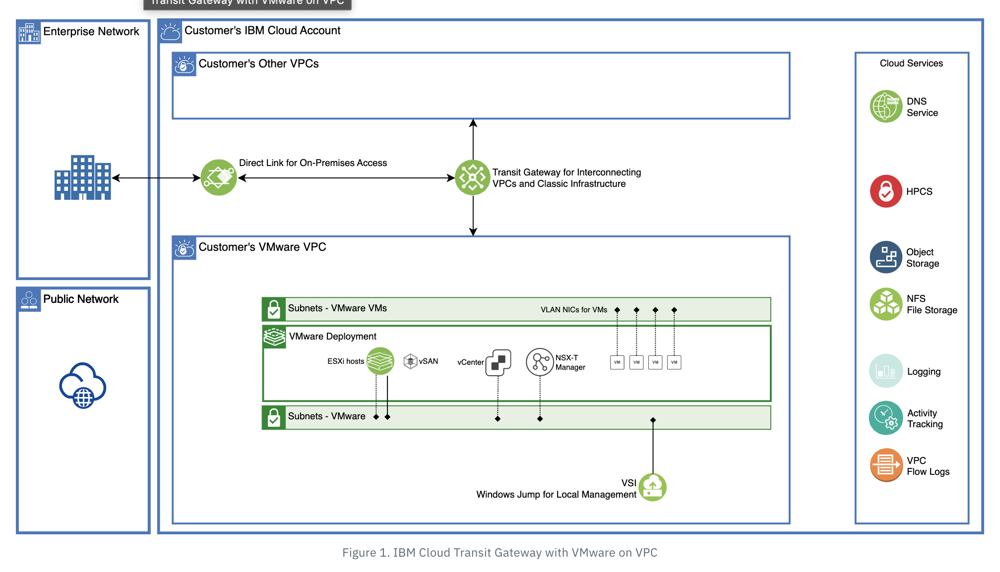

# IBM Cloud Transit Gateway - Terraform Module

With IBM Cloud® Transit Gateway (TGW), you can create a single or multiple transit gateways to connect VPCs together. You can also connect your IBM Cloud classic infrastructure to a Transit Gateway to provide seamless communication with Classic Infrastructure resources. Any new network that you connect to a Transit Gateway is then automatically made available to every other network connected to it. For more info [refer](https://cloud.ibm.com/docs/vmwaresolutions?topic=vmwaresolutions-interconnectivity-tgw-overview)

Following diagram illustrates the baisc transit gateway with VMware.



Below are the collection of modules that make it easier to provision transit gateway and configure multiple connections to it on IBM Cloud Platform:

* [tg-gateway-connection](modules/tg-gateway-connection)


## Usage

```hcl
data "ibm_resource_group" "resource_group" {
  name = var.resource_group_name
}

module "tg_gateway_connection" {
  source = "terraform-ibm-modules/transit-gateway/ibm//modules/tg-gateway-connection"

  transit_gateway_name = var.transit_gateway_name
  location             = var.location
  global_routing       = var.global_routing
  tags                 = var.tags
  resource_group_id    = data.ibm_resource_group.resource_group.id
  vpc_connections      = var.vpc_connections
  classic_connections_count   = var.classic_connections_count
}
```

<!-- BEGIN EXAMPLES HOOK -->
## Examples

- [ Transit Gateway Module Example](examples/tg-gateway-connection)
<!-- END EXAMPLES HOOK -->

<!-- BEGINNING OF PRE-COMMIT-TERRAFORM DOCS HOOK -->
## Requirements

| Name | Version |
|------|---------|
| <a name="requirement_terraform"></a> [terraform](#requirement\_terraform) | >= 1.0.0 |

## Modules

No modules.

## Resources

No resources.

## Inputs

No inputs.

## Outputs

No outputs.
<!-- END OF PRE-COMMIT-TERRAFORM DOCS HOOK -->

## Contributing

You can report issues and request features for this module in the [terraform-ibm-issue-tracker](https://github.com/terraform-ibm-modules/terraform-ibm-issue-tracker/issues) repo. See [Report an issue or request a feature](https://github.com/terraform-ibm-modules/.github/blob/main/.github/SUPPORT.md).

To set up your local development environment, see [Local development setup](https://terraform-ibm-modules.github.io/documentation/#/local-dev-setup) in the project documentation.
